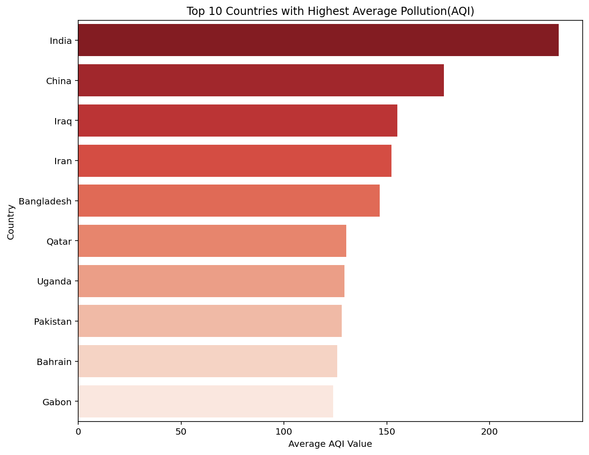
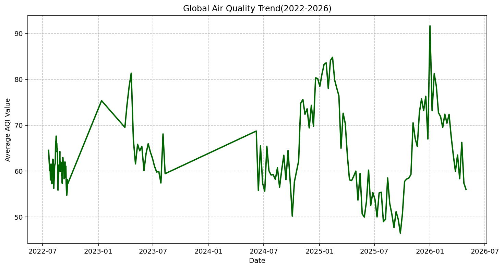
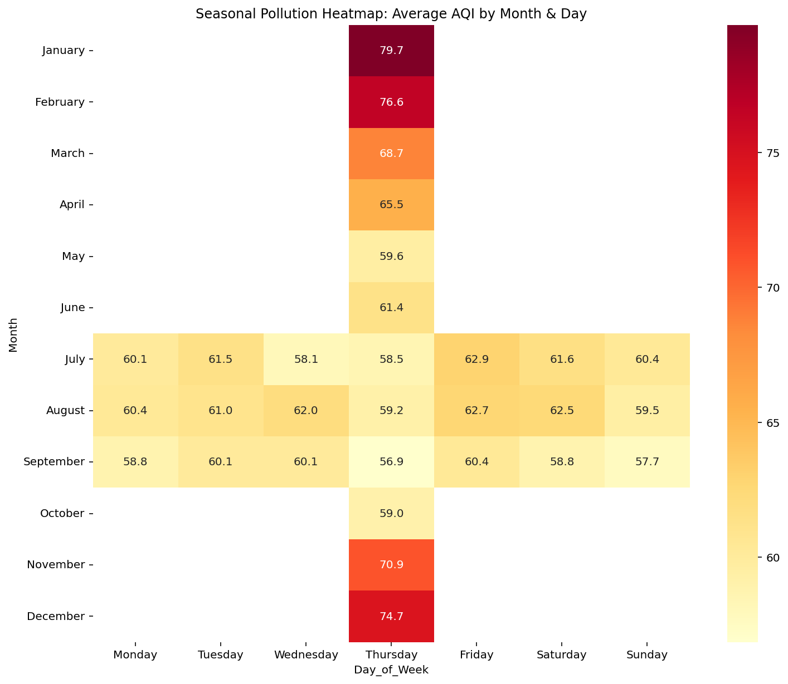

# air-quality--eda
This project examines global environmental sensor data to map out air pollution distributions and long-term historical trends. 
# Global Air Quality Index (AQI): Multi-Year Exploratory Data Analysis (EDA)

## 📌 Project Overview
This project examines global environmental data to map out air pollution distributions and long-term historical trends. Using Python and the Spyder IDE, I engineered a pipeline to track how AQI scores fluctuate across seasonal boundaries, identify the most critical global pollution hotspots, and analyze global atmospheric trends spanning from 2022 to 2026.

*Note: The underlying raw datasets are omitted from this public repository due to GitHub storage file-size constraints.*

## 🛠️ Tech Stack
- **IDE:** Spyder
- **Languages:** Python
- **Libraries:** Pandas, NumPy, Matplotlib, Seaborn

## 📊 Key Findings & Environmental Insights

### 1. Global Pollution Hotspots (Top 10 Most Polluted Countries)
This chart displays a ranked distribution of the countries recording the highest average AQI metrics globally.

* **Insight:** Industrialized nations and regions with specific geographical constraints display the highest AQI baselines, emphasizing a direct link between urban density and elevated particulate matter.

### 2. Multi-Year Atmospheric Trajectory (Air Quality Trend 2022-2026)
A long-term historical timeline tracking how the global or regional AQI baseline shifted across a 4-year macro window.

* **Insight:** The chronological data highlights cyclical peaks year-over-year. Analyzing the timeline from 2022 leading into 2026 reveals specific macro shifts in environmental pollution levels.

### 3. Micro-Climate Variations (Seasonal Pollution Analysis)
An evaluation showing how environmental and meteorological shifts throughout changing seasons directly warp local AQI scores.

* **Insight:** Pollution levels peak sharply during specific weather phases (such as dry/dusty seasons or winter industrial burning phases), indicating that atmospheric conditions are just as critical as raw emission volumes.
